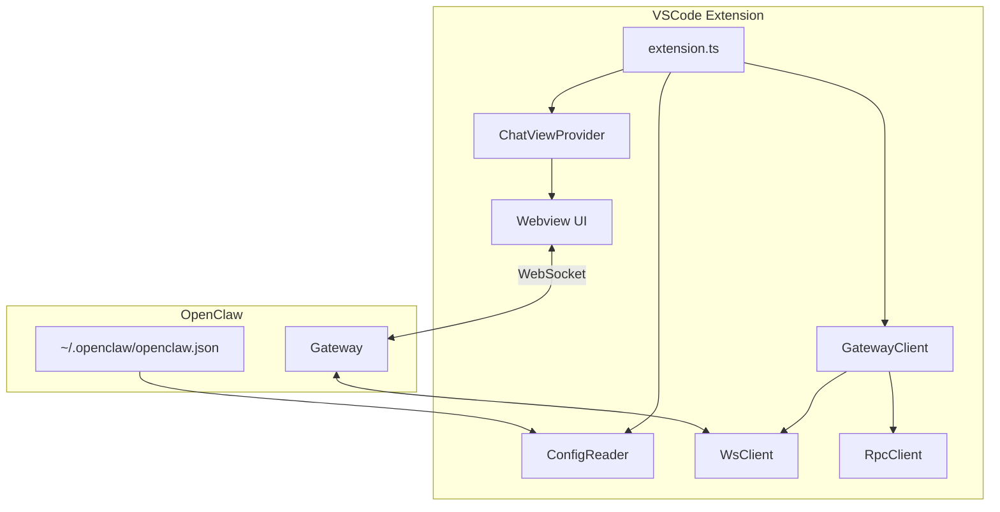
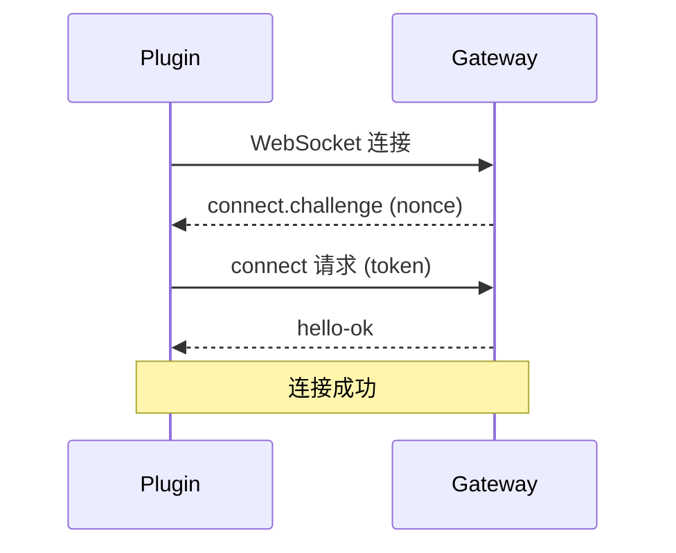

# OpenClaw VSCode 插件设计文档

**版本**: v3.0.0
**日期**: 2026-05-11
**状态**: 已确认
**基础项目**: [vscode-trace-extension](https://github.com/eclipse-cdt-cloud/vscode-trace-extension)

---

## 1. 需求背景

基于 vscode-trace-extension 魔改为 OpenClaw 的官方 VS Code 插件，核心功能：

- **可切换不同 Agent 进行对话**
- 每个 Agent 有独立的对话历史
- 与现有的模型切换共存（Agent + Model 两级选择）
- **最小改动原则**：保留项目结构，替换业务逻辑

---

## 2. 基础项目分析

### 2.1 项目结构

```
vscode-trace-extension/
├── vscode-trace-extension/     # 主扩展代码
│   ├── src/
│   │   ├── extension.ts        # 入口
│   │   ├── trace-explorer/     # 侧边栏 Views
│   │   ├── trace-viewer-panel/ # 主面板
│   │   └── utils/              # 工具类
│   └── package.json
├── vscode-trace-webviews/      # React Webview
│   ├── src/
│   │   ├── trace-explorer/     # 侧边栏 UI
│   │   └── trace-viewer/       # 主面板 UI
│   └── package.json
├── vscode-trace-common/        # 共享代码
│   ├── src/
│   │   ├── client/             # TSP Client
│   │   ├── messages/           # 消息类型
│   │   └── types/              # 类型定义
│   └── package.json
└── local-libs/                 # 本地依赖
```

### 2.2 核心组件映射

| Trace Extension | OpenClaw Extension | 说明 |
|----------------|-------------------|------|
| `TraceServerManager` | `GatewayManager` | 服务管理 |
| `backend-tsp-client-provider` | `gateway-client-provider` | 客户端提供者 |
| `tsp-client-provider-impl` | `gateway-client-impl` | 客户端实现 |
| `TraceExplorerOpenedTracesViewProvider` | `ChatViewProvider` | 聊天视图 |
| `TraceViewerPanel` | `ChatPanel` | 聊天面板 |
| `vscode-messages` | `vscode-messages` | 保留消息机制 |
| `TSP API` | `Gateway RPC` | 通信协议 |

---

## 3. 设计决策

| 项目 | 决定 | 理由 |
|------|------|------|
| **配置读取** | 直接读取 `~/.openclaw/openclaw.json` | 零配置，与 OpenClaw CLI 一致 |
| **认证方式** | 简单 Token 认证 | 实现简单，适合 VS Code 插件 |
| **Agent 列表** | 仅 RPC `agents.list` | Gateway 运行时状态最准确 |
| **Agent 切换** | 前端切换 sessionKey | 简单高效，无需网络请求 |
| **消息发送** | RPC `chat.send` + 事件监听 | 支持流式响应，体验好 |

---

## 4. 修改计划

### 4.1 包命名修改

```
vscode-trace-extension  → openclaw-vscode-extension
vscode-trace-webviews   → openclaw-vscode-webviews
vscode-trace-common     → openclaw-vscode-common
```

### 4.2 依赖修改

**移除**：
```json
"traceviewer-base": "0.11.0",
"traceviewer-react-components": "0.11.0"
```

**新增**：
```json
"uuid": "^9.0.0",
"zustand": "^4.5.0"
```

### 4.3 标识符替换

| 原标识 | 新标识 | 文件 |
|--------|--------|------|
| `traceViewer` | `openclaw` | package.json commands |
| `trace-explorer` | `openclaw-explorer` | package.json views |
| `trace-compass` | `openclaw` | package.json configuration |
| `Trace Viewer` | `OpenClaw` | 显示名称 |
| `eclipse-cdt` | `openclaw` | publisher |

### 4.4 文件修改清单

#### 扩展端 (vscode-trace-extension/src/)

| 文件 | 操作 | 说明 |
|------|------|------|
| `extension.ts` | 重写 | 入口改为 OpenClaw 初始化 |
| `common/trace-message.ts` | 重命名 → `openclaw-message.ts` | 消息类型 |
| `external-api/external-api.ts` | 重写 | 对外 API |
| `json-editor/*` | 删除 | 不需要 |
| `trace-explorer/*` | 重写 → `chat-explorer/` | 聊天侧边栏 |
| `trace-viewer-panel/*` | 重写 → `chat-panel/` | 聊天面板 |
| `utils/backend-tsp-client-provider.ts` | 重写 → `gateway-client-provider.ts` | Gateway 客户端 |
| `utils/trace-server-manager.ts` | 重写 → `gateway-manager.ts` | Gateway 管理 |
| `utils/trace-server-status.ts` | 重写 → `gateway-status.ts` | Gateway 状态 |
| `utils/trace-extension-logger.ts` | 重命名 → `extension-logger.ts` | 日志 |
| `utils/trace-extension-webview-manager.ts` | 重命名 → `webview-manager.ts` | Webview 管理 |

#### Webview 端 (vscode-trace-webviews/src/)

| 文件 | 操作 | 说明 |
|------|------|------|
| `trace-viewer/` | 重写 → `chat-view/` | 聊天界面 |
| `trace-explorer/` | 重写 → `chat-explorer/` | 侧边栏界面 |
| `common/vscode-message-manager.ts` | 保留 | 消息管理 |

#### 共享端 (vscode-trace-common/src/)

| 文件 | 操作 | 说明 |
|------|------|------|
| `client/tsp-client-provider-impl.ts` | 重写 → `gateway-client-impl.ts` | Gateway 实现 |
| `messages/vscode-messages.ts` | 重写 | OpenClaw 消息类型 |
| `types/customization.ts` | 删除 | 不需要 |
| `types/gateway.ts` | 新增 | Gateway 类型定义 |

---

## 5. 架构设计

### 5.1 整体架构



### 5.2 模块职责

| 模块 | 职责 |
|------|------|
| `ConfigReader` | 读取 `~/.openclaw/openclaw.json` 获取配置 |
| `WsClient` | WebSocket 连接管理、事件分发 |
| `RpcClient` | RPC 请求封装、Promise API |
| `GatewayClient` | Gateway 操作封装（认证、Agent、Chat） |
| `ChatViewProvider` | VS Code Webview Provider |
| `Webview UI` | 聊天界面（Agent 选择器、消息列表） |

---

## 6. Gateway 连接

### 6.1 连接流程



### 6.2 消息格式

| 类型 | 格式 |
|------|------|
| **请求** | `{ type: 'req', id, method, params }` |
| **成功响应** | `{ type: 'res', id, ok: true, payload }` |
| **失败响应** | `{ type: 'res', id, ok: false, error: { code, message } }` |
| **事件** | `{ type: 'event', event, payload }` |

### 6.3 关键 RPC 方法

| 方法 | 用途 | 参数 |
|------|------|------|
| `connect` | 认证连接 | `{ minProtocol, maxProtocol, role, client, scopes, auth }` |
| `agents.list` | 获取 Agent 列表 | `{}` |
| `agents.create` | 创建 Agent | `{ name, workspace, emoji? }` |
| `chat.send` | 发送消息 | `{ sessionKey, text, attachments? }` |

### 6.4 关键事件

| 事件 | 用途 |
|------|------|
| `connect.challenge` | 连接挑战（需响应 connect） |
| `chat` | 聊天消息流 |
| `agent` | Agent 状态变化 |

---

## 7. 实现步骤

### Phase 1: 项目重命名和清理

1. **重命名包和目录**
   - 修改所有 package.json 中的 name、displayName、description
   - 重命名目录：`vscode-trace-*` → `openclaw-vscode-*`
   - 更新 workspaces 配置

2. **替换标识符**
   - package.json 中的 commands、views、configuration
   - publisher 改为 `openclaw`

3. **移除不需要的文件**
   - `json-editor/` 目录
   - `test/` 目录（暂时）
   - `local-libs/traceviewer-libs/`（移除 trace 依赖）

### Phase 2: Gateway 客户端实现

1. **创建 Gateway 类型定义**
   ```typescript
   // openclaw-vscode-common/src/types/gateway.ts
   interface GatewayRequest {
     type: 'req';
     id: string;
     method: string;
     params?: Record<string, unknown>;
   }
   
   interface GatewayResponse {
     type: 'res';
     id: string;
     ok: boolean;
     payload?: unknown;
     error?: { code: number; message: string };
   }
   
   interface GatewayEvent {
     type: 'event';
     event: string;
     payload: unknown;
   }
   ```

2. **实现 Gateway 客户端**
   - 参考 `oooooooooooooffice/src/lib/gateway/`
   - 实现 WsClient、RpcClient、GatewayClient

3. **实现配置读取**
   - 读取 `~/.openclaw/openclaw.json`
   - 获取 gateway.host、gateway.port、gateway.token

### Phase 3: Chat 视图实现

1. **扩展端**
   - `ChatViewProvider` 替代 `TraceExplorerOpenedTracesViewProvider`
   - 实现 Agent 列表获取
   - 实现消息发送和接收

2. **Webview 端**
   - 聊天 UI（消息列表、输入框、发送按钮）
   - Agent 选择器（下拉菜单）
   - 消息状态显示

### Phase 4: 功能完善

1. **错误处理**
   - Gateway 未启动提示
   - 连接断开重连
   - 配置文件不存在引导

2. **用户体验**
   - 加载状态
   - 流式响应显示
   - 错误消息展示

---

## 8. 风险评估

| 风险 | 影响 | 缓解措施 |
|------|------|----------|
| Gateway 未启动 | 无法使用插件 | 显示友好提示，引导用户启动 |
| 配置文件不存在 | 无法读取配置 | 显示初始化引导 |
| WebSocket 断开 | 功能不可用 | 自动重连 + 状态指示 |
| traceviewer 依赖 | 可能影响构建 | 彻底移除相关代码 |

---

## 9. 下一步

- [ ] Phase 1: 项目重命名和清理
- [ ] Phase 2: Gateway 客户端实现
- [ ] Phase 3: Chat 视图实现
- [ ] Phase 4: 功能完善